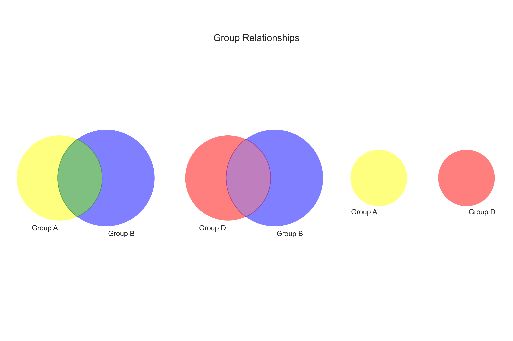
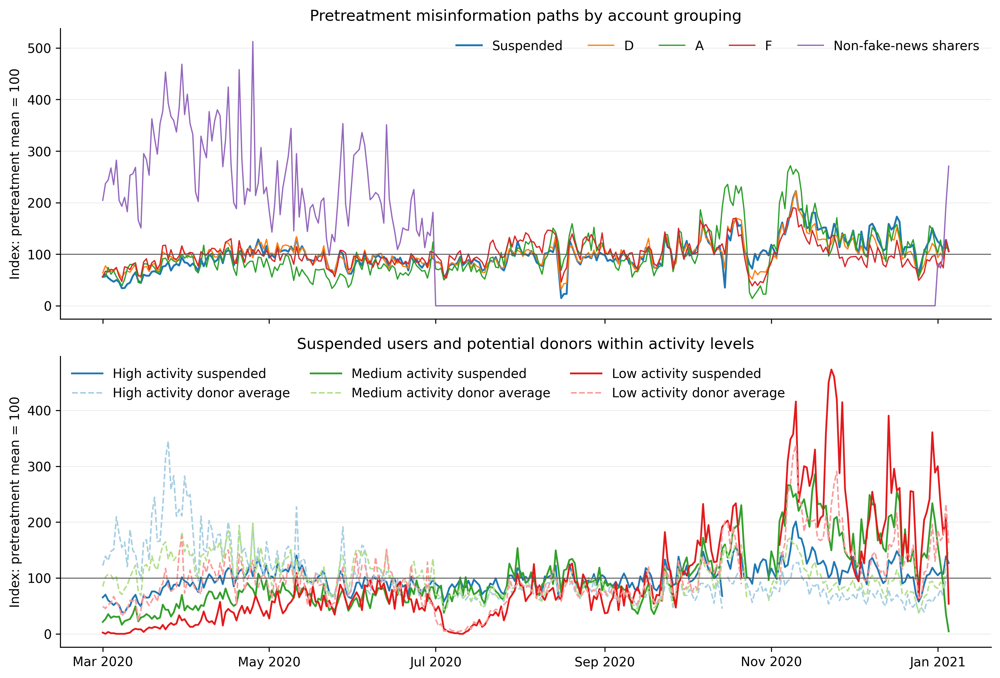
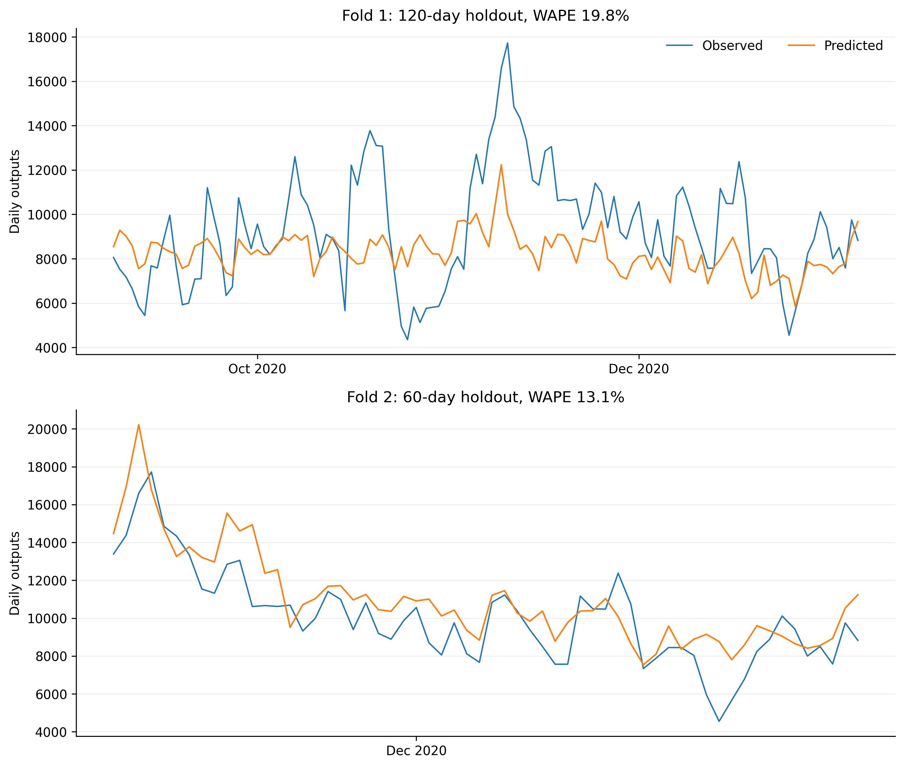
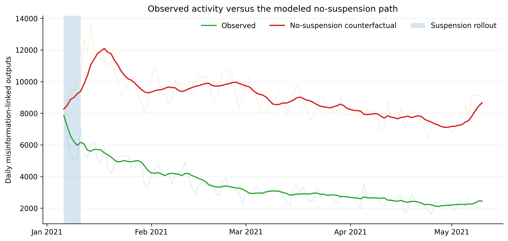
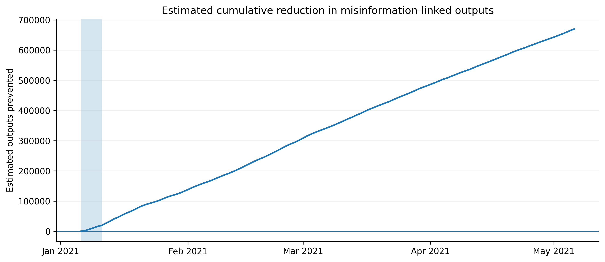
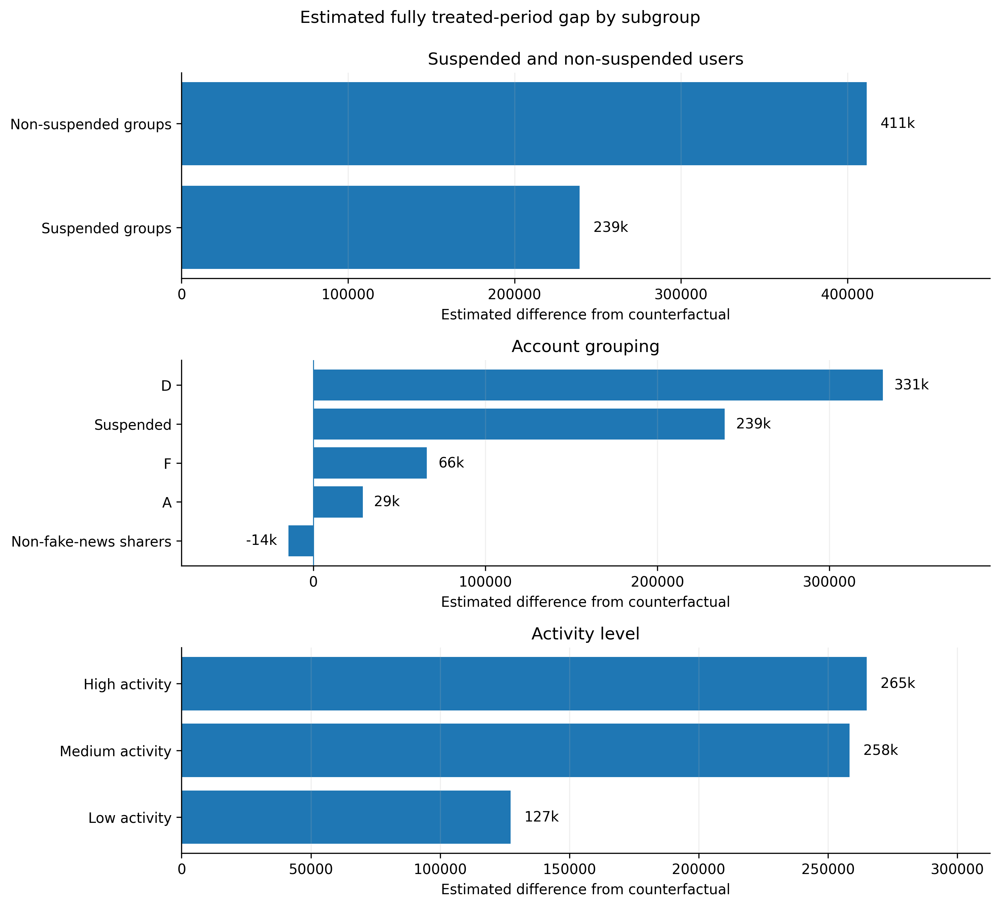

# Estimating the Effect of Twitter's January 2021 Suspensions on Misinformation

*A counterfactual modeling project using aggregated Twitter activity and GDELT event data*

## Overview

In January 2021, Twitter suspended a large set of accounts following the attack on the U.S. Capitol. Their removal is directly observable; once suspended, those accounts could no longer tweet or retweet. The harder question is what the wider study population would have produced if the suspensions had not occurred.

This project estimates that no-suspension counterfactual. It reconstructs a daily panel from anonymized replication data, models the activity patterns associated with misinformation sharing before treatment, and forecasts expected output through May 6, 2021.

For the fully treated period from January 12 through May 6, the model estimates:

| Counterfactual outputs | Observed outputs | Estimated outputs prevented | Estimated reduction |
| ---------------------: | ---------------: | --------------------------: | ------------------: |
|              1,027,265 |          376,757 |                     650,508 |               63.3% |

The estimate is best interpreted as the approximate cumulative difference between the observed and modeled paths. Pretreatment validation indicates that the model can recover broad levels over long forecast windows, but it does not support precise claims about each individual day.

## Objective

> **How many misinformation-linked tweets and retweets would the study population have produced if Twitter had not suspended the targeted accounts in January 2021?**

The project uses public replication data from McCabe et al., [“Post-January 6th deplatforming reduced the reach of misinformation on Twitter”](https://doi.org/10.1038/s41586-024-07524-8). The source study followed more than 500,000 active Twitter users whose identities could be cross-verified with voter-registration records.

Misinformation-linked activity is measured through tweets and retweets containing links to domains on the researchers' curated misinformation-source lists. The analysis therefore covers linked-domain misinformation within this study population, not every form of misleading content on Twitter.

## Data preparation

### Reconstructing mutually exclusive groups

The public data provides daily activity for overlapping user categories. Values were aggregated by McCabe et al. to preserve users privacy. Users are grouped by their misinformation-sharing behavior, whom they followed, whether they were later suspended, and their baseline activity level. Because the same users can appear in multiple source aggregates, those totals cannot be modeled as independent series.

The preprocessing notebook uses the known set relationships among the categories to reorganize the source data into mutually exclusive observations. The final panel contains five account groupings crossed with high, medium, and low activity levels, producing 15 daily series.

| Group     | Description                                                                             |
| --------- | --------------------------------------------------------------------------------------- |
| A         | Non-suspended misinformation sharers who followed Trump but no other deplatformed users |
| D         | Non-suspended misinformation sharers who followed at least four deplatformed users      |
| F         | Non-suspended misinformation sharers who followed no deplatformed users                 |
| `nfns`    | Users who did not share links from the misinformation-source lists                      |
| Suspended | Users removed during the January 2021 rollout                                           |

This process separates overlapping aggregate totals; it does not reconstruct individual users or recover user-level records.

*The source groups overlap, so set subtraction is required before their daily totals can be treated as separate series.*

### Distinguishing removal from missing data

The analytic panel covers November 30, 2019 through May 6, 2021. After January 12, missing rows for suspended groups are treated as structural zeroes because those accounts had been removed. Known collection disruptions before treatment are marked unavailable to prevent their interpretation as legitimate declines.

## Exploratory findings

Misinformation output is closely tied to general platform activity. Daily misinformation counts move with both tweet volume and the number of active users, so the model first estimates the underlying activity state and then predicts misinformation conditional on that state.

Additionally, the series are persistent and move through short, distorted waves. The model therefore includes recent levels, rolling behavior, slopes, and daily and weekly changes to better model the inherent irregularities in the data.

Non-suspended groups provide useful comparison information, but no single series provides enough information to be a stable control. Group D is the closest aggregate comparison to the suspended users before treatment, yet donor relationships vary over time. The final approach consequently learns from the full activity panel instead of assigning a fixed weight to one donor.

*Normalized pretreatment paths show meaningful shared movement across the suspended and potential donor series, along with differences that rule out treating any one donor as an equivalent control.*

## Modeling approach

The final estimator uses a two-stage, direct multi-horizon design.

### Stage 1: forecast the shared activity state

The first stage combines logged tweet volume and logged active-user counts for all 15 subsets. Principal component analysis reduces these measures to three shared activity factors, which explain 89.9% of the variation in the final pretreatment fit.

An Elastic Net model forecasts the future factors from recent factor states, calendar features, and lagged GDELT context. The factors are then reconstructed into expected activity and active-user levels for each subset.

### Stage 2: forecast misinformation conditional on activity

The second stage predicts a stabilized misinformation rate for each subset. A Ridge model was selected for this stage, and predicted rates are converted back into counts using the stage-one activity forecast.

The model grid evaluated Ridge, Extra Trees, k-nearest-neighbors, and Elastic Net estimators in both stages, with both count and rate targets. The selected combination—Elastic Net activity forecasting followed by Ridge rate forecasting—performed best under the blocked pretreatment selection criteria.

### External political context

GDELT data provide daily measures organized into four blocks: election attention, political actors, the broader event environment, and specific event categories. The raw variables are transformed and compressed into five principal components per block. The model then uses lagged, rolling, and change features derived from those components.

Each fold fits the transformations and principal components using only the information available before its forecast period.

### Direct forecasts and bridge calibration

The model predicts each future horizon directly from a known anchor date instead of recursively treating earlier predictions as observed data. This reduces the accumulation of small errors over a long post-treatment forecast.

A 28-day bridge period also measures recent systematic differences between the fitted and observed series. The final bridge has 12.9% aggregate WAPE, and its calibration corrections decay over the forecast horizon rather than remaining fixed through May.

## Pretreatment validation

The selected specification is evaluated on two contiguous held-out periods that reproduce the main forecasting problem: one 120-day horizon and one 60-day horizon.

| Validation period                 |     Horizon | Aggregate WAPE |
| --------------------------------- | ----------: | -------------: |
| September 8, 2020–January 5, 2021 |    120 days |          19.8% |
| November 7, 2020–January 5, 2021  |     60 days |          13.1% |
| **Mean**                          | **90 days** |      **16.4%** |

The model tracks broad levels across both periods, although it smooths or misses some daily peaks. This supports using the model to estimate cumulative scale while keeping day-specific interpretations modest.

*The held-out forecasts recover the general level and trajectory of misinformation-linked output, with better performance over the more recent 60-day period.*

## Results

### Estimated reduction

| Period                                | Counterfactual | Observed | Estimated prevented | Reduction |
| ------------------------------------- | -------------: | -------: | ------------------: | --------: |
| January 6–11 rollout                  |         56,342 |   36,966 |              19,376 |     34.4% |
| January 12–May 6 fully treated period |      1,027,265 |  376,757 |             650,508 |     63.3% |
| Full January 6–May 6 period           |      1,083,607 |  413,723 |             669,884 |     61.8% |

During the fully treated period, observed misinformation-linked output was approximately 63% below the modeled no-suspension level. Across the rollout and fully treated periods combined, the estimated cumulative difference reaches about 670,000 tweets and retweets.

*The seven-day observed average remains below the modeled no-suspension path throughout the post-treatment period. Lighter daily lines retain the underlying variation without implying day-level precision.*

*The modeled difference accumulates steadily and reaches approximately 670,000 outputs by May 6.*

### Where the modeled gap appears

The fully treated-period difference is divided between the directly suspended accounts and the non-suspended population:

| Component            | Estimated gap | Share of total gap |
| -------------------- | ------------: | -----------------: |
| Suspended groups     |       239,041 |              36.7% |
| Non-suspended groups |       411,466 |              63.3% |

The suspended component is, of course, much larger than the actual observed behavior in the post-treatment period.

The non-suspended component is more inferential. Group D accounts for approximately 331,000 of the 411,000 non-suspended gap, or about 80%. Groups A and F also remain below their modeled paths, while the `nfns` group exceeds its very small counterfactual estimate. The concentration in group D is consistent with a broader network response because these users followed at least four deplatformed accounts. The aggregate data do not observe exposure or diffusion chains, so this pattern should not be treated as a separately identified spillover mechanism.

By activity level, high-activity users contribute the largest absolute gap at approximately 265,000 outputs. Medium-activity users account for about 258,000, and low-activity users account for about 127,000. The low-activity stratum has the largest proportional difference from its modeled counterfactual, but its lower baseline volume limits its absolute contribution.

*The subgroup results show that most of the modeled gap lies among non-suspended users, particularly group D, while high- and medium-activity users contribute similar absolute amounts.*

## Interpretation

Within this study population and outcome definition, the January 2021 suspensions were followed by a large and persistent decline relative to a pretreatment-trained no-suspension model. The estimated difference during the fully treated period is approximately 651,000 misinformation-linked outputs, or 63.3% of the modeled counterfactual volume.

The results also indicate that the modeled change was not confined to the removed accounts. Nearly two-thirds of the total gap appears among non-suspended groups, with most of that difference concentrated among users who followed several deplatformed accounts. This is consistent with the intervention altering the wider sharing environment as well as eliminating direct output from suspended accounts.

The evidence is strongest for the direction and approximate cumulative scale of the difference. It is weaker for exact daily effects and for claims about the mechanism behind the non-suspended decline.

## Limitations

- **The counterfactual is model-based.** There is no observed untreated version of the same network after January 2021.
- **Validation does not imply daily precision.** The long held-out forecasts recover broad levels better than individual peaks and troughs.
- **The data are aggregated.** The public files do not contain individual users, retweet chains, exposure, or direct influence measures.
- **The outcome is narrower than misinformation overall.** It captures activity linking to classified domains, not every misleading statement, image, or screenshot.
- **Collection disruptions require analyst judgment.** Affected windows are excluded from model targets rather than treated as genuine zeroes.
- **Subgroup gaps are descriptive components of the model estimate.** They do not separately identify network spillovers or other mechanisms.
- **The residual simulation is not reported as a conventional confidence interval.** Its saved output is not centered on the point estimate, so the report relies on observed pretreatment forecast performance to communicate uncertainty.

## Project structure

| File              | Component                     | Purpose                                                                                                                                                   |
| ----------------- | ----------------------------- |
| `data-prep.ipynb` | Data preparation notebook     | Reconstructs mutually exclusive account groups from overlapping replication aggregates and inspects collection anomalies.                                 |
| `eda.ipynb`       | Exploratory analysis notebook | Builds the analytic panel, distinguishes structural zeroes from disruptions, and evaluates time-series dynamics, donor relationships, and GDELT features. |
| `modeling.pynb`   | Modeling notebook             | Selects and validates the two-stage model, estimates the counterfactual, and generates the final figures and tables.                                      |

Additionally the SQL queries used to collect the GDELT data can be found in `sql`.

The preprocessing and exploratory notebooks run relatively quickly. The modeling notebook is more computationally intensive because it tunes multiple stage-one and stage-two model families across blocked forecast windows before refitting the selected specification.

## Source

McCabe, S. D., Ferrari, D., Green, J., et al. (2024). “Post-January 6th deplatforming reduced the reach of misinformation on Twitter.” *Nature*, 630, 132–140. https://doi.org/10.1038/s41586-024-07524-8
